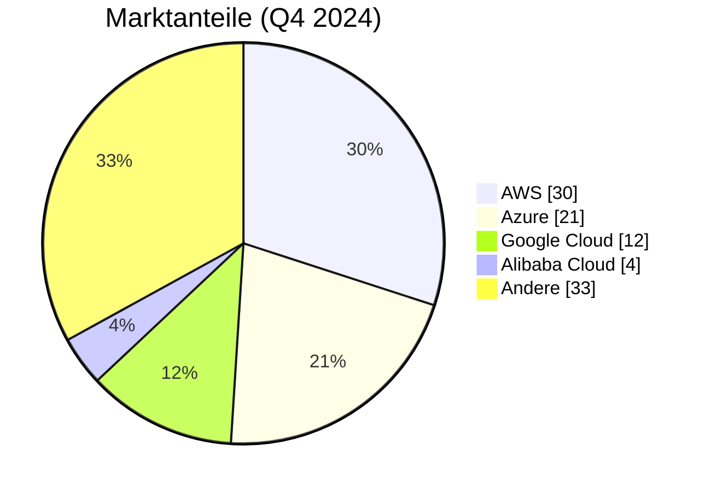

<!-- Guten Tag, mein Name ist Paul Oellers. Ich begrüße Sie herzlich zu meiner Präsentation über Multi-Cloud-Management im Rahmen des Moduls Wissenschaftliches Arbeiten.

Heute gebe ich Ihnen einen Überblick darüber, was Multi-Cloud-Management bedeutet, wie es in Unternehmen eingesetzt wird und welche Chancen und Herausforderungen damit verbunden sind.

 Ziel dieser Präsentation ist es, Ihnen die wichtigsten Konzepte, Anwendungsfälle und Zukunftstrends rund um Multi-Cloud näherzubringen, sodass Sie das Thema strategisch einordnen können. -->

<h1 class="text-6xl font-bold leading-tight shrink-0">
  Multi-Cloud-Management
</h1>

<h2 class="text-1xl leading-tight shrink-0 text-gray-600">
Modul: Wissenschaftliches Arbeiten
</h2>

  Paul Oellers

---
layout: center
---

# 📑 Inhaltsverzeichnis

1. Was ist Multi-Cloud?
2. Größte Cloud-Anbieter
3. Anwendung von Multi-Cloud in Unternehmen
4. Vorteile & Herausforderungen von Multi-Cloud
5. Zukunft von Multi-Cloud
6. Q&A

<!--
Lassen Sie uns zunächst einen kurzen Überblick über die Struktur dieser Präsentation geben, damit Sie wissen, was Sie erwartet. 

Am Ende der Präsentation können Sie gerne Ihre Fragen stellen, oder wenn Sie möchten, auch während der Präsentation, wenn etwas unklar ist.
-->

---
layout: center
---

# Was ist Multi-Cloud?

### 💡 Definition

- **Multi-Cloud** bezeichnet die gleichzeitige Nutzung von Cloud-Diensten mehrerer Anbieter.
- Beispiel: Ein Unternehmen nutzt **AWS** für Datenverarbeitung und **Azure** für Benutzerverwaltung.

### 🎯 Motivation

- Vermeidung von **Vendor Lock-in**
- Zugriff auf **spezialisierte Dienste** je Anbieter
- Höhere **Verfügbarkeit** durch redundante Architekturen

📊 Bereits **89 % der Unternehmen** verfolgen eine Multi-Cloud-Strategie
_(Quelle: Flexera Report)_

<!--
Multi-Cloud bedeutet also, dass Unternehmen nicht nur einen Cloud-Anbieter nutzen, sondern mehrere parallel einsetzen. 

Die Motivation dahinter ist vielfältig: Zum einen wollen Unternehmen sich nicht von einem einzigen Anbieter abhängig machen, also den sogenannten Vendor Lock-in vermeiden.

Zum anderen können sie so die spezialisierten Dienste der verschiedenen Anbieter nutzen und durch redundante Architekturen eine höhere Verfügbarkeit sicherstellen.

Die hohe Verbreitung von Multi-Cloud-Strategien zeigt, wie relevant dieses Thema heute ist.
-->

---
layout: center
---

# Größte Cloud-Anbieter

- **Amazon Web Services (AWS)** – Amazons Cloud-Plattform, Marktführer
- **Microsoft Azure** – Cloud-Angebot von Microsoft
- **Google Cloud Platform (GCP)** – Cloud-Dienste von Google
- **Alibaba Cloud** – größter Cloud-Anbieter in Asien
- _Weitere:_ z. B. IBM Cloud, Oracle Cloud (jeweils <5 % Marktanteil)

_(Quelle: Synergy Research Group)_

<!--
Hier sehen wir die größten Cloud-Anbieter und deren Marktanteile, um ein Gefühl für die Marktsituation zu bekommen. 

AWS ist klarer Marktführer, gefolgt von Microsoft Azure, die vor allem im Enterprise-Bereich stark sind. 

Google Cloud punktet besonders im Bereich künstliche Intelligenz, während Alibaba Cloud in Asien eine bedeutende Rolle spielt.
-->

---
layout: center
---

# Anwendung von Multi-Cloud in Unternehmen

<logos-aws class="absolute top-2 right-2 text-3xl text-gray-400" />

### 💻 AWS

Redshift, Athena  
➡️ Datenanalyse großer Mengen in Echtzeit

<logos-microsoft-azure class="absolute top-2 right-2 text-3xl text-gray-400" />

### 🔐 Azure

Azure AD, MFA  
➡️ Sichere Authentifizierung und zentrale Identitätsverwaltung

<logos-google-cloud class="absolute top-2 right-2 text-3xl text-gray-400" />

### 🤖 Google Cloud

Vertex AI, TensorFlow  
➡️ Entwicklung und Deployment von ML-Modellen

<logos-linux-mint class="absolute top-2 right-2 text-3xl text-gray-400" />

### 🏛️ Private Cloud

VMs, lokale Datenbanken  
➡️ Hosting kritischer Daten mit hoher Kontrolle & DSGVO-Konformität

<!--
In der Praxis nutzen Unternehmen die Stärken der verschiedenen Cloud-Anbieter gezielt aus. 

So wird AWS häufig für umfangreiche Datenanalysen verwendet, während Azure mit seinen Sicherheitsdiensten punktet. 

 Google Cloud ist eine beliebte Plattform für Machine Learning und KI-Anwendungen. 

 Ergänzt wird dies oft durch Private Clouds, um sensible Daten besonders geschützt und DSGVO-konform zu hosten. 

Durch die Kombination dieser Plattformen erreichen Unternehmen eine maximale Effizienz und bleiben unabhängig.
-->

---
layout: center
---

# Vorteile & Herausforderungen von Multi-Cloud

### ✅ Vorteile

- **Flexibilitä**t: Nutzung der besten Dienste verschiedener Anbieter

- Ausfallsicherheit durch **Redundanz**

- **Kostenoptimierung** durch gezielte Auswahl

- **Geringere Abhängigkeit** von einem Anbieter

### ⚠️ Herausforderungen

- Komplexe **Verwaltung** mehrerer Plattformen

- Schwierige Integration **heterogener** Dienste

- Erschwerte **Kostenkontrolle**

- Unterschiedliche **Sicherheits- und Compliance-Anforderungen**

<!--
Die Vorteile von Multi-Cloud liegen klar auf der Hand: Unternehmen können flexibel die besten Dienste auswählen, die Ausfallsicherheit erhöhen und Kosten optimieren. 

Gleichzeitig reduziert sich die Abhängigkeit von einem einzelnen Anbieter, was die strategische Position stärkt. 

 Allerdings bringt Multi-Cloud auch Herausforderungen mit sich, wie die komplexe Verwaltung verschiedener Plattformen und die Integration unterschiedlicher Dienste. 

Auch die Kostenkontrolle wird schwieriger, ebenso wie die Einhaltung verschiedener Sicherheits- und Compliance-Vorgaben.
-->

---
layout: center
class: heading-center
---

# Zukunftstrends im Multi-Cloud-Management

### 🧠 Autonome Cloud-Betriebsmodelle

- Self-healing Infrastrukturen mit AI Ops
- Predictive Scaling statt reaktiver Steuerung

### 🌍 Souveräne & geopolitisch sichere Clouds

- Nationale Cloud-Initiativen & Gaia-X
- Datenhoheit bei regulatorisch sensiblen Workloads

### 📦 Fully abstracted Multi-Cloud Platforms

- Workload-Mobilität ohne Cloud-spezifische Konfiguration
- „Deploy anywhere“-Ansätze über Meta-Clouds (z. B. Crossplane, Upbound)

### 🧬 Cloud + Quantum + Edge

- Nutzung von Quanten-Clouds über zentrale Orchestrierung
- Integrierte Edge+Cloud Workloads für Latenzkritik & Offline-Fähigkeit

<!--
Schauen wir nun in die Zukunft des Multi-Cloud-Managements. 

Die Entwicklung geht weit über heutige Tools hinaus und setzt verstärkt auf Automatisierung und intelligente Betriebsmodelle, die sich selbst heilen und vorausschauend skalieren. 

 Zudem gewinnen souveräne Cloud-Lösungen an Bedeutung, die nationalen und geopolitischen Anforderungen gerecht werden, wie zum Beispiel Gaia-X.

 Fully abstracted Multi-Cloud Plattformen ermöglichen es, Workloads ohne cloud-spezifische Anpassungen überall einzusetzen, was die Flexibilität weiter erhöht.

Schließlich werden neue Technologien wie Quantencomputing und Edge Computing integriert, um hochkomplexe und latenzkritische Anwendungen zu unterstützen.
-->

---
layout: center
---

# Vielen Dank.

Noch Fragen?

#### Quellen

- **Synergy Research Group**: _Marktanteile Cloud-Infrastruktur Q4 2024_  
  DOI: [Synergy Research](https://www.statista.com/chart/18819/worldwide-market-share-of-leading-cloud-infrastructure-service-providers/)

- **Flexera**: _State of the Cloud Report 2024_  
  [Flexera Report](https://info.flexera.com/CM-REPORT-State-of-the-Cloud-DE?lead_source=Organic%20Search)

<!-- Ich danke Ihnen für Ihre Aufmerksamkeit. Wenn Sie Fragen haben, beantworte ich diese gerne jetzt oder im Anschluss. -->

<!-- Mögliche Fragen könnten sein, wann sich Multi-Cloud nicht lohnt, wie sich Multi-Cloud von Hybrid-Cloud unterscheidet oder welche Rolle FinOps dabei spielt. -->

<!--
Auch das Thema Datenhoheit in mehreren Clouds ist oft ein wichtiger Diskussionspunkt, den wir gerne vertiefen können.
-->
